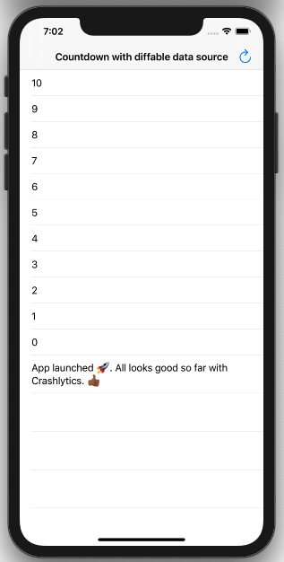
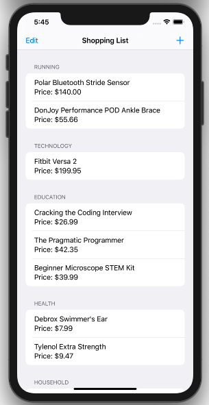
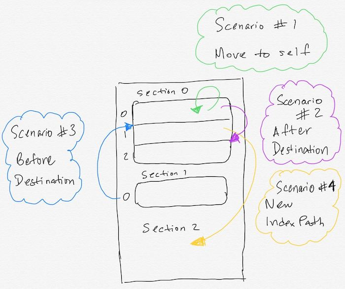

# Diffable Data Source

## 1. Objective 

* To discuss the new declarative way of handling data sources in iOS. 
* Know how to configure a `UITableViewDiffableDataSource` type. 
* Understand `NSDiffableDataSourceSnapshot` and how to appy it to the data source. 
* Subclass `UITableViewDiffableDataSource<SectionIdentifier, ItemIdentifier>`. 
* Identify the benefits of using diffable data source for table view and collection views going forward. 


## 2. Introducting Diffable Data Sources

In iOS 13 at WWDC 2019, Apple, introduced a new approach to handling data sources when it comes to setting up table views and collection views. This new approach aims to solve a varied amount of potential bugs in iOS development. Some of the reasons behind those potential bugs is due to the fact there are various state changes in which our data and UI can be and different sources of truth. With the introduction of diffable data sources there is one source of truth. This source of truth we will see throughout this lesson is a universal **snapshot** associated with the table view or collection view. Once you adopt diffable data sources no longer will you encounter the following errors below, where your app crashes at runtime due to `NSInternalInconsistencyException`: 

<pre> 
2020-07-11 22:01:50.650853-0400 UIDataSources[7989:2888089] *** Terminating app due to uncaught exception 
'NSInternalInconsistencyException', reason: 'Invalid update: invalid number of rows in section 0. The 
number of rows contained in an existing section after the update (15) must be equal to the number of rows
contained in that section before the update (15), plus or minus the number of rows inserted or deleted 
from that section (0 inserted, 1 deleted) and plus or minus the number of rows moved into or out of that
section (0 moved in, 0 moved out).
</pre>


This potential error has been eradicated with diffable data sources because there is one source of truth. The data source always has the most current state of the data via the **snapshot**. 

#### Declarative Approach 

With the introduction of SwiftUI, collection view compostional layout and diffable data sources in iOS 13, Apple is clearly moving away from the imperative approach to programming and using declarative and a compositional approach. In declarative programming you describe the structure of the program rather than describing its control flow. 


## 3. UITableViewDiffableDataSource 

Traditionally for our data source in a table view and collection views we implemented `cellForRow(at:)` and `numberOfRows(at:)` in order to setup the data for the table view or collection view. As we get new data for example from a web service API we needed to have a property observer on the main collection (array or dictionary) for the data soruce and then have `reloadData` called to update the table view's items. In this tradional approach as stated earlier, this lead to different sources of truth for the data soruce and more maintaining our UI in various places which leads to bugs. 

Both table views and collection views support diffable data source. We use their respective APIs of `UITableViewDiffableDataSource` or `UICollectionViewDiffableDataSource` to create and configure a data soruce instance. After modifying the snapshot, we use `apply()` to commit the changes which updates the table view UI. With diffable data source we now have only one source of truth which is the **snapshot**. We can then query this snapshot for any sort of modification needed or query we have about the data. 


## 4. Configure the table view or collection view using Storyboard or Programmatic UI 

```swift 
private var tableView: UITableView! 

tableView = UITableView(frame: view.bounds, style: .plain)
tableView.autoresizingMask = [.flexibleWidth, .flexibleHeight]
tableView.backgroundColor = .systemBackground
tableView.register(UITableViewCell.self, forCellReuseIdentifier: "cell")
view.addSubview(tableView)
```

> Requirements as with the traditional way of configuring a table view is to register a cell

## 5. Setting up the UITableViewDiffableDataSource

`UITableViewDiffableDataSource` is a generic class that has two types. Both types need to conform to the `Hashable` protocol: 

1. SectionIdentifierType: representes the sections of the table view or collection view. 
2. ItemIdentifierType: represents the items of a particular section. 

#### Define the Section identifier type  

It's good practice to use an `enum` which is by default `Hashable` and have your sections as cases of the enum type. 

```swift 
enum Section {
  case main 
}
```

#### Define the Item identifier type  

This will be the type of the items in the table view cells or collection view cells. Again here the `ItemIdentifierType` of the `UITableViewDiffableDataSource` needs to conform to `Hashable`. We also use the `hash` function to define which property of the Item type should be used for hashing the type's uniqueness. In the case below we use the `identifier` property. 

```swift 
struct Item: Hashable {
  let name: String
  let price: Double
  let identifier = UUID()
  
  func hash(into hasher: inout Hasher) {
    hasher.combine(identifier)
  }
}
```

#### Declare an instance of the data soruce 

```swift 
private var dataSource: UITableViewDiffableDataSource<Section, Item>!
```

In the declaration above both types are required to conform to the `Hashable` protocol as this maintains uniqueness of the section values and item values of the sections. 

> If you need to to use other data source methods from `UITableViewDataSource` such as `titleForHeaderInSection()` or `commit editingStyle:` then you have to subclass `UITableViewDiffableDataSource` and match the `SectionIdentifierType` and the `ItemIdentifierType` as you defined for the data source. 

A subclass stub of `UITableViewDiffableDataSource`

```swift 
class DataSource: UITableViewDiffableDataSource<Section, Item> {
  // protocol methods
  override func tableView(_ tableView: UITableView, titleForHeaderInSection section: Int) -> String? {
    // code here
  }
}
```

Using the `DataSource` subclass we can now update our declaration for the `dataSource` instance to use this subclass. 

```swift 
private var dataSource: DataSource!
```


#### Configuring the data source instance

```swift 
// 1 
dataSource = DataSource(tableView: tableView, cellProvider: { (tableView, indexPath, item) -> UITableViewCell? in
  let cell = tableView.dequeueReusableCell(withIdentifier: "cell", for: indexPath)
  cell.textLabel?.text = item.name
  return cell
})

// 2 
dataSource.defaultRowAnimation = .fade
```

1. `cellProvider` is a closure that has 3 arguments: a pointer to the tableView, indexPath of the current item and the item itself. This closure returns an optional `UITableViewCell`. The closure body is the place for cell configurations like done traditionally in the `cellForRow(at:)` method. In the cell provider we do not use the indexPath to find the item in question as we have a pointer to the item as one of the three arguments. 

2. Add the default row animation to the data source. The default animation is `.automatic`. Some other options `.fade` `.top` `.bottom`


## 6. Setting up the snapshot 

As stated throughout this lesson the snapshot is the _source of truth_ for our table view's data so let's go ahead and configure it. The basic steps for setting up a snapshot is as follows: 

1. Declare an instance of `NSDiffableDataSourceSnapshot` which needs to match the section and item type you specified for the data source earlier. 
2. Append the required sections to the snapshot. 
3. Append the items for the section or each section if the table view or collection view has multiple sections. 
4. Apply the snapshot to the data source. This step is the required step to update the current snapshot which will render items to the table view or collection view. 

```swift 
// 1 
var snapshot = NSDiffableDataSourceSnapshot<Section, Item>()

// 2 
snapshot.appendSections([.main])

// 3 
snapshot.appendItems(items)

// 4
dataSource.apply(snapshot, animatingDifferences: false)
```

## 7. Some useful actions on a snapshot 

#### 1. Getting the current snapshot 

```swift 
let updatedSnapshot = dataSource.snapshot() 
```

#### 2. Using the snapshot to perform an operation on each section of a Table View or Collection View

```swift 
updatesSnapshot.sectionIdentifiers.forEach {
  // code here
}
```

## 8. Glossary 

1. UITableViewDiffableDataSource 
1. UICollectionViewDiffableDataSource
1. NSDiffableDataSourceSnapshot
1. SectionIdentifierType
1. ItemIdentifierType 
1. `apply()`
1. `snapshot()`
1. `itemIdentifier(for:)`
1. CellProvider 

## 9. Countdown app using diffable data source

Our countdown app will start from 10 and decrement the initial value by 1 every second and add the new value as a row in the table view. Throughout the app we will make use of the **snapshot** as we update the table view and `apply` the changes. 

1. Create an Xcode project named **Countdown**.
2. Navigate to the ViewController.swift file and add the following: 
```swift 
enum Section {
  case main 
}

private var tableView: UITableView! 
private var dataSource: UITableViewDiffableDataSource<Section, Int>! 
private var timer: Timer! 
private var startInterval = 10 // seconds 
```
3. Configure the table view. 
4. Configure the data source. 
5. Configure the timer. 
6. Add the `startCountdown` method. 
7. Add the `decrementCounter` method.
8. Add the `ship` method. 
9. Add a `refresh` bar button item to restart countdown.




[Completed Project](https://github.com/alexpaul/Diffable-Data-Source/tree/master/Countdown)

## 10. Shopping list app using diffable data source

In the Shopping app the user will be able view multiple sections of items and their categories. The user will be able to add a new item to a given section. The user will be able to remove an item for the shopping list. The user will also be able to reorder items. 

#### Part 1 - Multiple Sections

1. Create an Xcode project named **ShoppingList**. 
2. Define an `enum` called **Category** that will comprise of a series of item categories e.g running, technology, health. 
3. Create the main model for the ShoppingList app and name it **Item**. Item will have the following properties: 
    * name 
    * price
    * category
    * identifier
   Also Item will have to conform to the `Hashable` protocol in order to be an `ItemIdentifierType` on the `UITableViewDiffableDataSource`. We can also define 
   which property to be made the hashable value using the `func hash(into hasher:)` method. 
4. Subclass `UITableViewDiffableDataSource` so we are able to implement the necessary `UITableViewDataSource` methods we will need for the ShoppingList app. Some 
   of the protocol methods we will use include `func tableView(_ tableView: UITableView, titleForHeaderInSection section: Int)`. 
5. Configure the table view to take up the entire view's bounds. This can be done programmactically or via storyboard. 
6. Configure the data source using diffable data source.
7. Setup the initial snapshot and iterate through the **Category** cases to create the sections. Use `filter` to get all the relevant items for a given section as
   you iterate through the categories. The initial items for the sections will be fetched from a `func testData() -> [Item]` static method. 
8. Implement `func tableView(_ tableView: UITableView, titleForHeaderInSection section: Int)` to get the title for each of the sections. 
9. Complete app at the end of Part 1 should look like the following: 

   
   
#### Part 2 - Add an item to a given section 

#### Part 3 - Delete a given item 

#### Part 4 - Reorder itmes 

Reordering rows has a varied numbered of steps and is quite complex. There are four main scenarios at pictured below in order to achieve reordering.

Scenarios: 

1. Moving to the same index path. 
2. Moving the source item after the destination item. 
3. Moving the source item before the destination item. 
4. Moving the item to an index path that does yet exist. 



Below are all the steps needed for reordering: 

1. Get the source item using the source index path. 
2. **Scenario 1**: Check to make sure the item is not being moved to the same index path. 
3. Get the destination item that will be replaced at the given destination index path. 
4. Get the current snapshot. 
5. **Scenario 2 and 3** Moving to an index path that exist. Here you want to make sure the destination item is not nil. 
    1. Get the source index and the destination index. 
    2. Determine whether the source item should be inserted before or after the destination item. 
    3. Remove the source item from the snapshot before inserting the item at its new position. 
    4. **Scenario 2**: Moving the source item after the destination item. 
    5. **Scenario 3**: Moving the source item before the destination item. 
6. **Scenario 4**: Moving the item to an index path that does not yet exist. 
    1. Get the destination section identifier. 
    2. Remove the source item from the snapshot before inserting the item at its new position.
    3. Append the item at its new section destination. 
7. Apply the snapshot. 

> As of this writing as per animatingDifference make sure to keep at the default state of false. Attempting to set it to true and animate as reordering happens will lead to an internal consistency crash. 

## 11. Resources 

1. [Apple docs - UITableViewDiffableDataSource](https://developer.apple.com/documentation/uikit/uitableviewdiffabledatasource)
2. [Apple docs - UICollectionViewDiffableDataSource](https://developer.apple.com/documentation/uikit/uicollectionviewdiffabledatasource)
3. [WWDC 2019 - Advances in UI Data Sources](https://developer.apple.com/videos/play/wwdc2019/220/)
4. [Apple docs - Table Views](https://developer.apple.com/documentation/uikit/views_and_controls/table_views)
5. [NSDiffableDataSourceSnapshot](https://developer.apple.com/documentation/uikit/nsdiffabledatasourcesnapshot)

